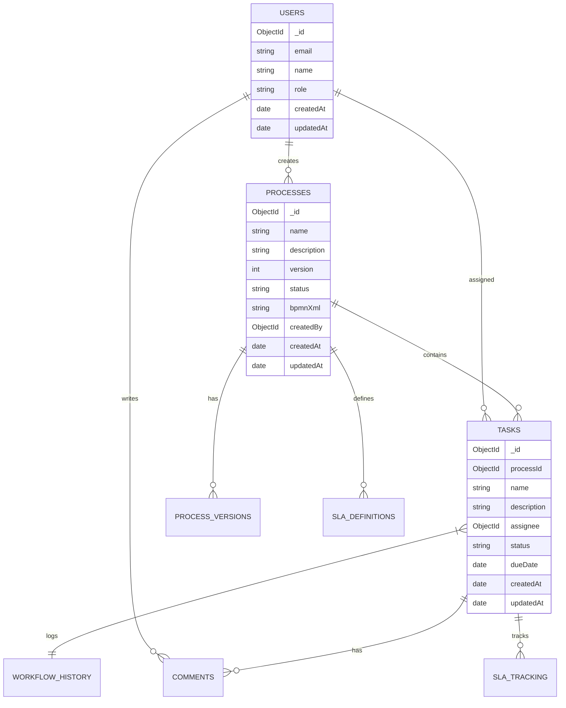
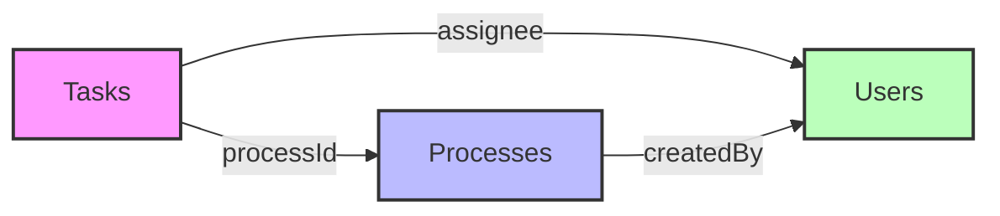

# 📚 Database Schema Documentation

## 🗄️ Collections Overview

Our MongoDB database is organized into several collections, each serving a specific purpose in the BPM platform.

### Entity Relationship Diagram



## 📋 Collection Details

### 👤 Users Collection

```javascript
{
  _id: ObjectId,
  email: String,         // Unique email address
  name: String,          // Full name of the user
  role: String,          // [admin, manager, user]
  settings: {
    language: String,    // Preferred language
    timezone: String,    // User's timezone
    theme: String        // UI theme preference
  },
  createdAt: Date,
  updatedAt: Date
}
```

#### 🔑 Indexes
- `{ email: 1 }` (unique)
- `{ role: 1 }`

### 📝 Processes Collection

```javascript
{
  _id: ObjectId,
  name: String,          // Process name
  description: String,   // Detailed description
  version: Number,       // Current version number
  status: String,        // [draft, active, archived]
  bpmnXml: String,      // BPMN 2.0 XML definition
  metadata: {
    category: String,    // Process category
    tags: [String],      // Search tags
    priority: Number     // Process priority
  },
  createdBy: ObjectId,   // Reference to Users
  createdAt: Date,
  updatedAt: Date
}
```

#### 🔑 Indexes
- `{ name: 1 }`
- `{ "metadata.category": 1 }`
- `{ status: 1 }`

### ✅ Tasks Collection

```javascript
{
  _id: ObjectId,
  processId: ObjectId,   // Reference to Processes
  name: String,          // Task name
  description: String,   // Task description
  assignee: ObjectId,    // Reference to Users
  status: String,        // [pending, active, completed, failed]
  priority: Number,      // Task priority (1-5)
  dueDate: Date,        // Deadline
  metadata: {
    type: String,        // Task type
    category: String,    // Task category
    tags: [String]       // Search tags
  },
  createdAt: Date,
  updatedAt: Date
}
```

#### 🔑 Indexes
- `{ processId: 1 }`
- `{ assignee: 1 }`
- `{ status: 1 }`
- `{ dueDate: 1 }`

## 🔒 Data Validation

### Users Validation Rules

```javascript
{
  validator: {
    $jsonSchema: {
      bsonType: "object",
      required: ["email", "name", "role"],
      properties: {
        email: {
          bsonType: "string",
          pattern: "^[a-zA-Z0-9._%+-]+@[a-zA-Z0-9.-]+\\.[a-zA-Z]{2,}$"
        },
        role: {
          enum: ["admin", "manager", "user"]
        }
      }
    }
  }
}
```

## 🔄 Relationships



## 💾 Backup Strategy

### 🔄 Backup Schedule
- 📅 Daily full backups at 00:00 UTC
- 🕐 Hourly incremental backups
- ⏱️ Point-in-time recovery enabled
- 🌍 Geo-redundant backup storage

### 🔒 Security Measures
1. 🔐 Field-level encryption for sensitive data
2. 👥 Role-based access control
3. 🔒 TLS/SSL encryption for all connections
4. 📝 Comprehensive audit logging

## 📊 Performance Optimization

### 🚀 Indexing Strategy
- Compound indexes for frequent queries
- Text indexes for search functionality
- TTL indexes for temporary data

### 🎯 Query Optimization
- Covered queries where possible
- Aggregation pipeline optimization
- Proper index usage monitoring

## 🔍 Monitoring

### 📈 Key Metrics
- Query performance
- Index usage
- Storage utilization
- Connection pool status

### ⚡ Performance Alerts
- Slow query warnings
- High CPU usage
- Memory pressure
- Disk space warnings
