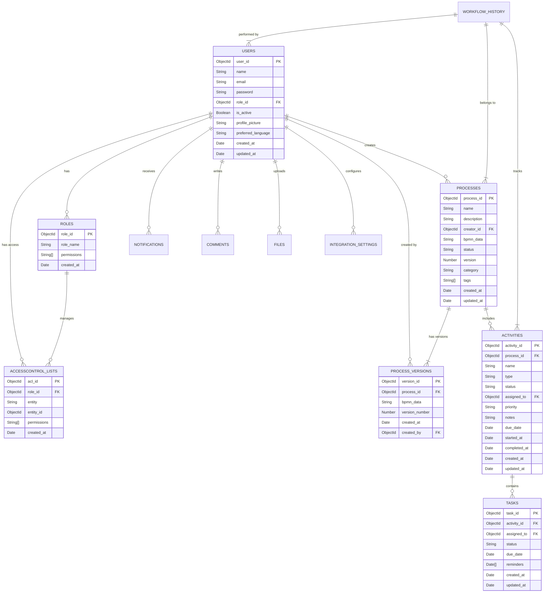

# 📚 BPM Platform Database Schema

## 🎯 Overview

Our BPM Platform uses MongoDB as its primary database, implementing a comprehensive schema design that supports all business process management functionalities. This document details the collections, relationships, and optimization strategies.

## 🗄️ Core Collections

### Entity Relationship Diagram



## 📦 Collection Details

### 👤 Users & Authentication

#### Users Collection
```javascript
{
  _id: ObjectId,
  name: String,            // User's full name
  email: String,           // Unique email address
  password: String,        // Hashed password
  role_id: ObjectId,       // Reference to ROLES
  is_active: Boolean,      // Account status
  profile_picture: String, // URL to profile picture
  settings: {
    language: String,      // Preferred language
    timezone: String,      // User's timezone
    theme: String         // UI theme preference
  },
  created_at: Date,
  updated_at: Date
}
```

### 🔐 Access Control

#### Roles Collection
```javascript
{
  _id: ObjectId,
  role_name: String,      // e.g., "admin", "manager", "user"
  permissions: [String],  // Array of permission codes
  created_at: Date
}
```

### 📋 Process Management

#### Processes Collection
```javascript
{
  _id: ObjectId,
  name: String,           // Process name
  description: String,    // Process description
  creator_id: ObjectId,   // Reference to USERS
  bpmn_data: String,     // BPMN 2.0 XML
  status: String,        // ["draft", "active", "completed", "archived"]
  version: Number,       // Current version number
  category: String,      // Process category
  tags: [String],        // Search tags
  metadata: {
    priority: Number,    // Process priority
    estimated_time: Number,
    cost_center: String
  },
  created_at: Date,
  updated_at: Date
}
```

## 🔍 Indexing Strategy

### 🎯 Performance Indexes

```javascript
// Users Collection
db.users.createIndex({ "email": 1 }, { unique: true })
db.users.createIndex({ "role_id": 1 })

// Processes Collection
db.processes.createIndex({ "creator_id": 1 })
db.processes.createIndex({ "status": 1 })
db.processes.createIndex({ "category": 1 })
db.processes.createIndex({ "tags": 1 })

// Activities Collection
db.activities.createIndex({ "process_id": 1 })
db.activities.createIndex({ "assigned_to": 1 })
db.activities.createIndex({ "status": 1, "due_date": 1 })
```

## 🛡️ Data Validation

### Validation Rules Example

```javascript
db.createCollection("users", {
  validator: {
    $jsonSchema: {
      bsonType: "object",
      required: ["email", "name", "role_id"],
      properties: {
        email: {
          bsonType: "string",
          pattern: "^[a-zA-Z0-9._%+-]+@[a-zA-Z0-9.-]+\\.[a-zA-Z]{2,}$"
        },
        role_id: {
          bsonType: "objectId"
        }
      }
    }
  }
})
```

## 📊 Performance Optimization

### 🚀 Query Optimization Tips

1. **Use Covered Queries**
   ```javascript
   // Good ✅
   db.users.find({ role_id: ObjectId("...") }, { email: 1, _id: 0 })
   
   // Avoid ❌
   db.users.find({ role_id: ObjectId("...") })
   ```

2. **Compound Indexes for Common Queries**
   ```javascript
   // For status + date range queries
   db.tasks.createIndex({ "status": 1, "due_date": 1 })
   ```

## 🔒 Security Measures

### 1. Field-Level Encryption
```javascript
{
  "integration_settings": {
    "api_key": {
      "$encrypt": {
        "keyId": ["UUID"],
        "algorithm": "AEAD_AES_256_CBC_HMAC_SHA_512_Random"
      }
    }
  }
}
```

### 2. Access Control
```javascript
db.createRole({
  role: "processViewer",
  privileges: [
    {
      resource: { db: "bpm_platform", collection: "processes" },
      actions: [ "find" ]
    }
  ],
  roles: []
})
```

## 💾 Backup Strategy

### 🔄 Automated Backups

1. **Daily Full Backup** (00:00 UTC)
```bash
mongodump --uri="mongodb://localhost:27017/bpm_platform" --out=/backup/daily/$(date +%Y%m%d)
```

2. **Hourly Incremental Backup**
```bash
mongodump --uri="mongodb://localhost:27017/bpm_platform" --out=/backup/hourly/$(date +%Y%m%d_%H) --incremental
```

### 🌍 Geo-Redundancy
- Primary backup: AWS S3
- Secondary backup: Azure Blob Storage
- Tertiary backup: Local NAS

## 📈 Monitoring & Alerts

### Key Metrics
- Query performance
- Index usage statistics
- Storage utilization
- Connection pool status

### Alert Thresholds
- Query execution time > 100ms
- Storage usage > 80%
- Connection pool usage > 85%
- Index miss rate > 5%
