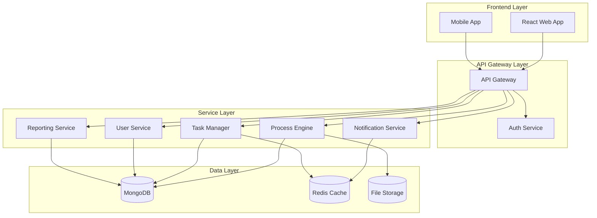
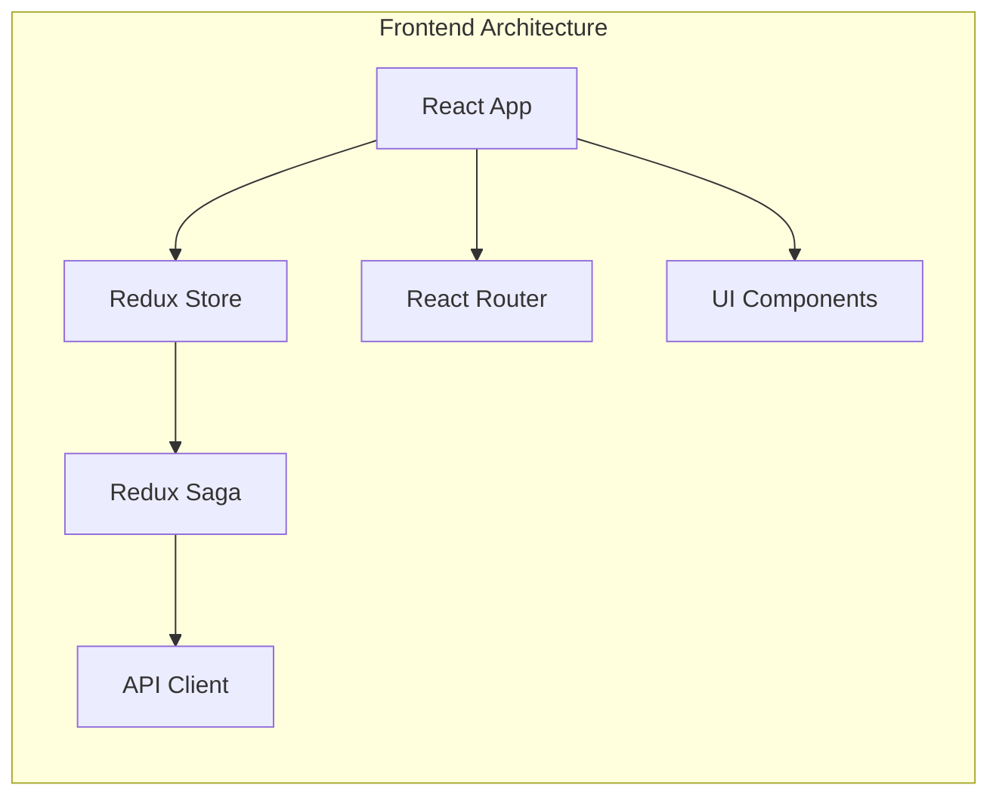
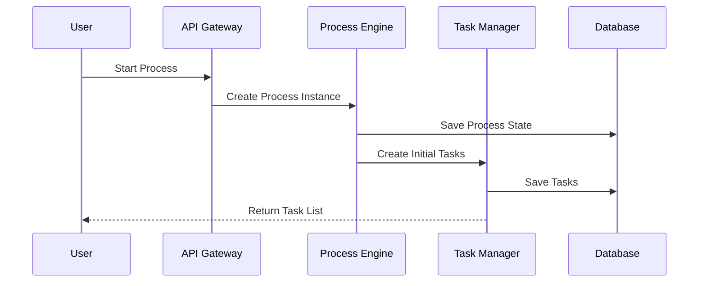
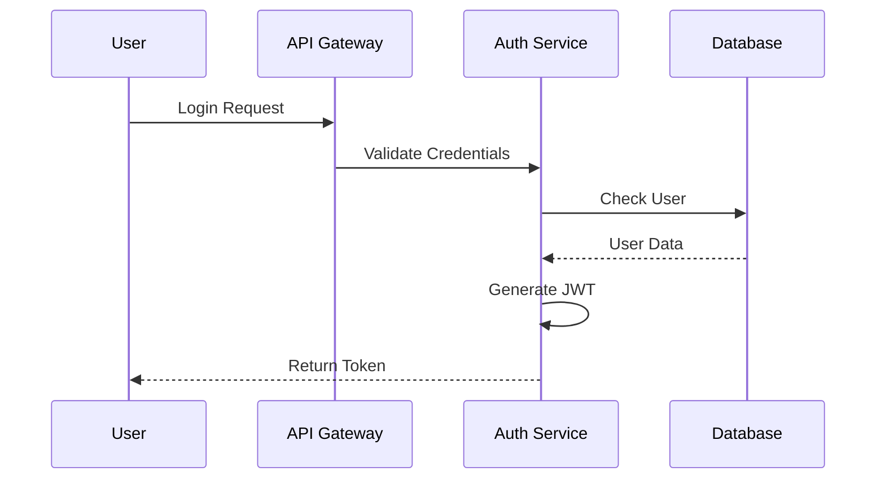
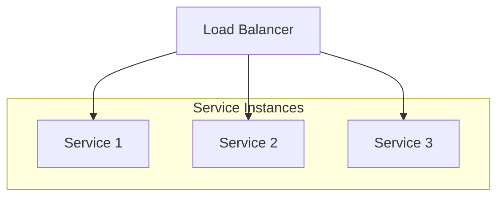
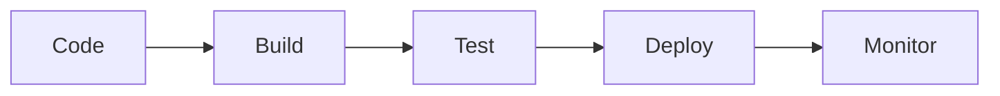
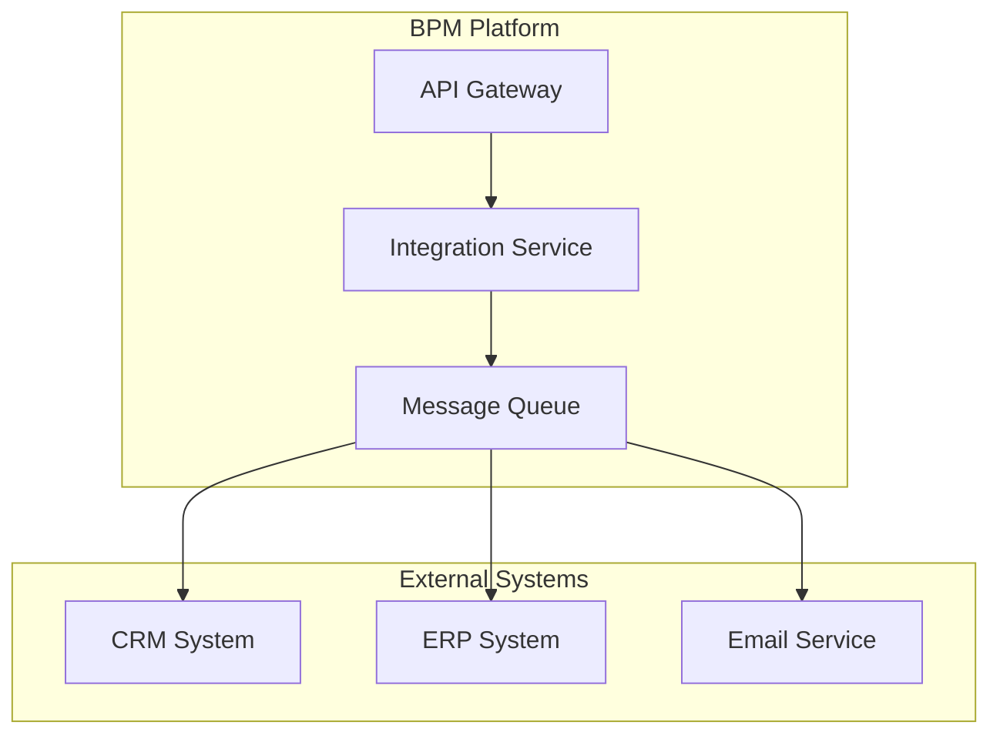

# 🏗️ BPM Platform Architecture

## 📋 Table of Contents
1. [System Overview](#system-overview)
2. [Architecture Principles](#architecture-principles)
3. [System Components](#system-components)
4. [Technology Stack](#technology-stack)
5. [Data Flow](#data-flow)
6. [Security Architecture](#security-architecture)
7. [Scalability & Performance](#scalability--performance)
8. [Deployment Strategy](#deployment-strategy)
9. [Monitoring & Logging](#monitoring--logging)
10. [Disaster Recovery](#disaster-recovery)

## 🎯 System Overview

The BPM Platform is a cloud-native business process management solution designed to handle complex workflow automation needs at scale. The system follows a microservices architecture pattern, enabling modularity, scalability, and maintainability.

### High-Level Architecture

## 🎨 Architecture Principles

1. **Microservices-Based**
   - Loosely coupled services
   - Independent deployment
   - Service-specific databases
   - API-first design

2. **Cloud-Native**
   - Containerization (Docker)
   - Orchestration (Kubernetes)
   - Auto-scaling
   - Service mesh integration

3. **Event-Driven**
   - Asynchronous communication
   - Message queues
   - Event sourcing
   - CQRS pattern

4. **Security-First**
   - Zero-trust architecture
   - End-to-end encryption
   - Role-based access control
   - Regular security audits

## 🔧 System Components

### Frontend Components

### Backend Services

1. **Process Engine Service**
   - BPMN workflow execution
   - Process versioning
   - State management
   - Activity coordination

2. **Task Management Service**
   - Task assignment
   - Due date tracking
   - Priority management
   - Task notifications

3. **User Service**
   - User management
   - Authentication
   - Authorization
   - Profile management

4. **Notification Service**
   - Real-time notifications
   - Email notifications
   - SMS notifications
   - In-app notifications

5. **Reporting Service**
   - Process analytics
   - Performance metrics
   - Custom reports
   - Data export

## 🛠️ Technology Stack

### Frontend
- React.js 18+
- Redux for state management
- Material-UI components
- WebSocket for real-time updates

### Backend
- Node.js 18+ with Express
- TypeScript for type safety
- MongoDB for data storage
- Redis for caching

### Infrastructure
- Docker containers
- Kubernetes orchestration
- AWS cloud services
- Terraform for IaC

## 🔄 Data Flow

### Process Execution Flow

## 🔒 Security Architecture

### Authentication Flow

### Security Measures

1. **API Security**
   - JWT authentication
   - Rate limiting
   - Request validation
   - API key management

2. **Data Security**
   - Encryption at rest
   - Encryption in transit
   - Field-level encryption
   - Regular backups

3. **Access Control**
   - Role-based access
   - Resource-level permissions
   - IP whitelisting
   - Session management

## 📈 Scalability & Performance

### Horizontal Scaling

### Performance Optimization
1. **Caching Strategy**
   - Redis for session data
   - CDN for static assets
   - Database query caching
   - API response caching

2. **Database Optimization**
   - Indexing strategy
   - Query optimization
   - Data partitioning
   - Connection pooling

## 🚀 Deployment Strategy

### CI/CD Pipeline

### Environment Strategy
- Development
- Staging
- UAT
- Production

### Deployment Process
1. **Build Phase**
   - Code compilation
   - Unit tests
   - Static analysis
   - Docker image creation

2. **Test Phase**
   - Integration tests
   - E2E tests
   - Security scans
   - Performance tests

3. **Deploy Phase**
   - Blue-green deployment
   - Canary releases
   - Rollback capability
   - Health checks

## 📊 Monitoring & Logging

### Monitoring Stack
- Prometheus for metrics
- Grafana for visualization
- ELK stack for logs
- New Relic for APM

### Key Metrics
1. **System Metrics**
   - CPU usage
   - Memory usage
   - Disk I/O
   - Network traffic

2. **Application Metrics**
   - Response time
   - Error rates
   - Request volume
   - Active users

3. **Business Metrics**
   - Process completion rate
   - Task completion time
   - User engagement
   - System usage

## 🔄 Disaster Recovery

### Backup Strategy
1. **Database Backups**
   - Daily full backups
   - Hourly incrementals
   - Point-in-time recovery
   - Geo-replication

2. **Application Backups**
   - Configuration backups
   - File storage backups
   - System state backups
   - Audit logs

### Recovery Procedures
1. **High Availability**
   - Multi-AZ deployment
   - Automatic failover
   - Load balancing
   - Health monitoring

2. **Recovery Plans**
   - RTO objectives
   - RPO objectives
   - Failover procedures
   - Communication plan

## 🔄 Integration Architecture

### External System Integration

### Integration Patterns
1. **Synchronous Integration**
   - REST APIs
   - GraphQL
   - gRPC
   - WebSockets

2. **Asynchronous Integration**
   - Message queues
   - Event streams
   - Webhooks
   - Pub/Sub

## 📝 Documentation Strategy

### Technical Documentation
- API documentation
- System architecture
- Deployment guides
- Security protocols

### User Documentation
- User manuals
- Admin guides
- Integration guides
- Best practices

## 🔄 Future Considerations

1. **Scalability**
   - Global deployment
   - Multi-region support
   - Edge computing
   - Serverless architecture

2. **Technology**
   - AI/ML integration
   - Blockchain integration
   - IoT support
   - Advanced analytics

3. **Security**
   - Zero-trust implementation
   - Quantum-safe encryption
   - Advanced threat protection
   - Compliance automation
