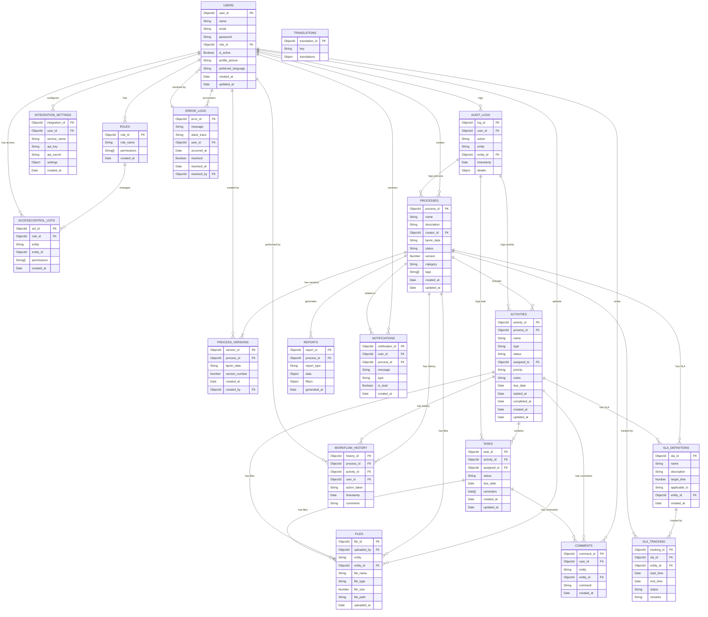

# Database Schema Documentation

## Entity Relationship Diagram



## Indexes and Performance Optimization

### Collection Indexes

1. Users Collection
```javascript
db.users.createIndex({ "email": 1 }, { unique: true })
db.users.createIndex({ "role_id": 1 })
```

2. Processes Collection
```javascript
db.processes.createIndex({ "creator_id": 1 })
db.processes.createIndex({ "status": 1 })
db.processes.createIndex({ "category": 1 })
db.processes.createIndex({ "tags": 1 })
```

3. Activities Collection
```javascript
db.activities.createIndex({ "process_id": 1 })
db.activities.createIndex({ "assigned_to": 1 })
db.activities.createIndex({ "status": 1 })
db.activities.createIndex({ "due_date": 1 })
```

## Data Validation Rules

### Users Collection
```javascript
{
  validator: {
    $jsonSchema: {
      bsonType: "object",
      required: ["email", "password", "name"],
      properties: {
        email: {
          bsonType: "string",
          pattern: "^[a-zA-Z0-9._%+-]+@[a-zA-Z0-9.-]+\\.[a-zA-Z]{2,}$"
        },
        password: {
          bsonType: "string",
          minLength: 8
        }
      }
    }
  }
}
```

### Processes Collection
```javascript
{
  validator: {
    $jsonSchema: {
      bsonType: "object",
      required: ["name", "creator_id", "status"],
      properties: {
        status: {
          enum: ["draft", "active", "completed", "archived"]
        }
      }
    }
  }
}
```

## Backup Strategy

1. Daily Full Backup
```bash
mongodump --uri="mongodb://localhost:27017/bpm_platform" --out=/backup/daily/$(date +%Y%m%d)
```

2. Hourly Incremental Backup
```bash
mongodump --uri="mongodb://localhost:27017/bpm_platform" --out=/backup/hourly/$(date +%Y%m%d_%H) --incremental
```

3. Point-in-Time Recovery
- Oplog retention: 24 hours
- Backup retention: 30 days

## Security Considerations

1. Field Level Encryption
```javascript
{
  "integration_settings": {
    "api_key": {
      "$encrypt": {
        "keyId": ["UUID"],
        "algorithm": "AEAD_AES_256_CBC_HMAC_SHA_512_Random"
      }
    }
  }
}
```

2. Access Control
```javascript
db.createRole({
  role: "processViewer",
  privileges: [
    {
      resource: { db: "bpm_platform", collection: "processes" },
      actions: [ "find" ]
    }
  ],
  roles: []
})
